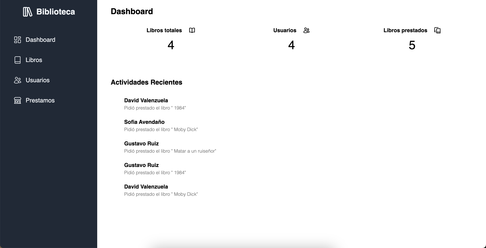
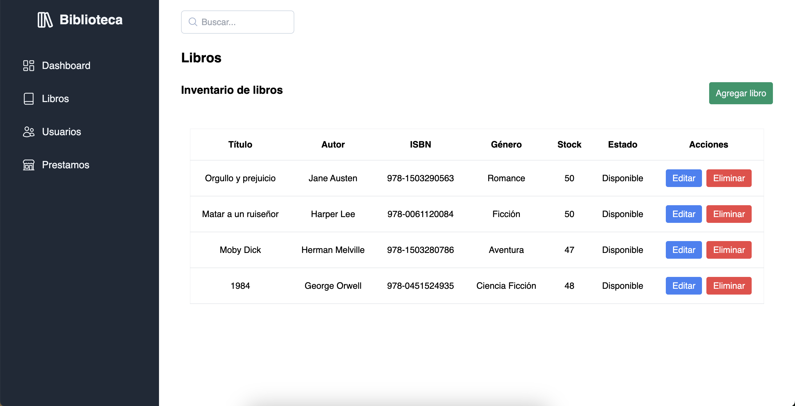
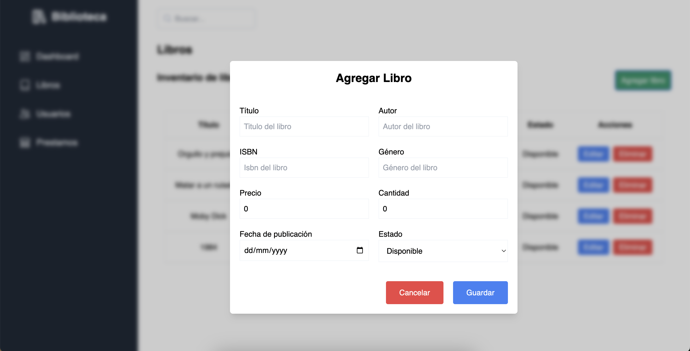
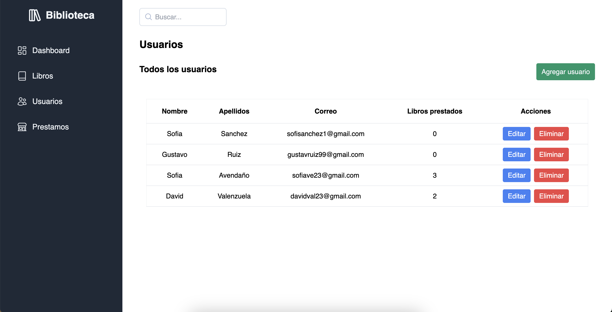
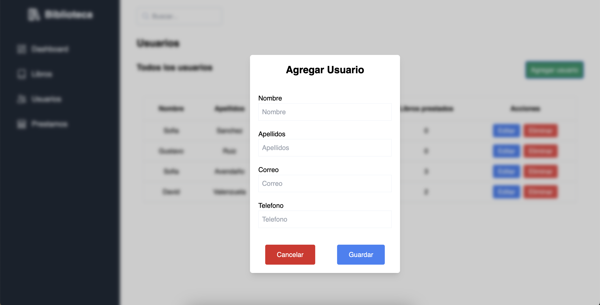
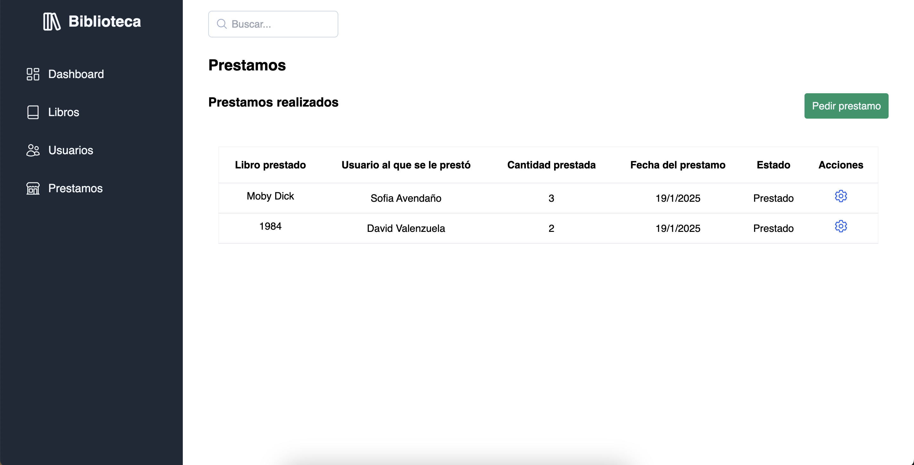
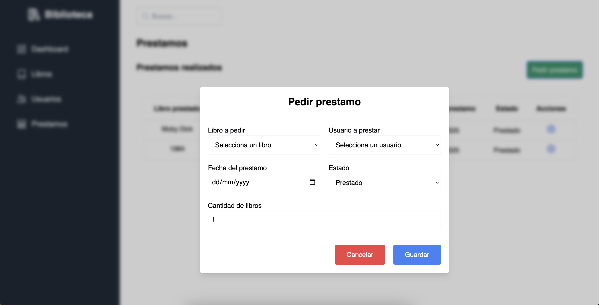

# Gestión de Préstamos de Libros

## Descripción

Este proyecto es un un sistema para una biblioteca. El encargados puede registrar, editar y eliminar libros, gestionar los préstamos de los usuarios, así como consultar la disponibilidad de los libros. La aplicación tiene una interfaz sencilla y eficiente que facilita el control de los inventarios y el seguimiento de los préstamos.

## Tecnologías Utilizadas

- **Frontend**: React, TypeScript, TailwindCSS
- **Backend**: Node.Js, Express.Js
- **Base de datos**: PostgreSQL

## Funcionalidades

### Dashboard

El **Dashboard** es la pantalla principal donde los encargados pueden ver el resumen de los prestamos hechos ultimamente, así como ver la cantidad que hay de libros, usuarios registrados y cuantos prestamos se han hecho en total.

### Vista Libros

En la vista de libros puedes ver todos los libros disponibles, así como poder agregar nuevos, editar o eliminar los ya existentes

#### Agregar Libro

Los encargados pueden agregar nuevos libros a la biblioteca. Para esto, se accede a una pantalla donde se pueden ingresar los detalles del libro, como el título, autor, ISBN, género, precio y cantidad de libros disponibles.

### Vista Usuarios

En la vista de usuarios puedes ver todos los usuarios disponibles, así como poder agregar nuevos, editar o eliminar los ya existentes

#### Agregar Usuario

Los encargados pueden agregar nuevos usuarios. Para esto, se accede a una pantalla donde se pueden ingresar los detalles del usuario, como el Nombre, Apellidos, Correo, Etc.

### Vista Prestamos

En la vista de prestamos puedes ver todos los prestamos realizados, así como poder hacer un nuevo prestamo, o marcar cuando un usuario te devolvió un libro

#### Realizar Un Prestamo

Los encargados pueden hacer prestamos a los usuarios registrados. Para esto, se accede a una pantalla donde se pueden ingresar los detalles del prestamo, como el nombre del usuario a realizar el prestamo, el libro a prestar, etc.

